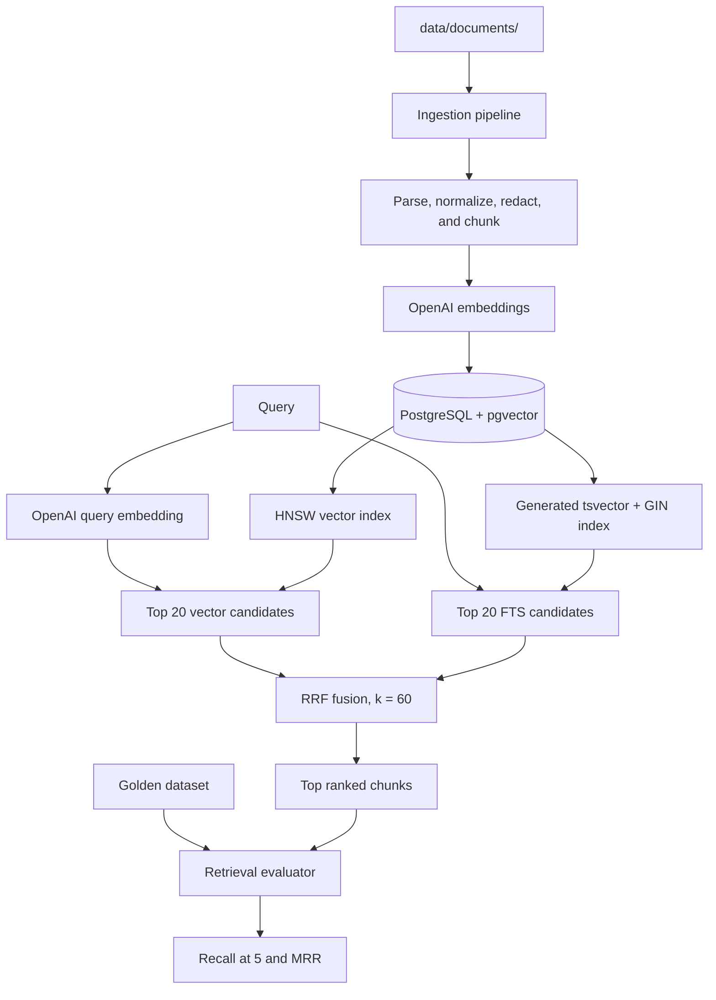

# System Flow

## Purpose and scope

This repository is a retrieval-only pipeline. It ingests documents, creates
vector and full-text indexes, retrieves relevant chunks with hybrid search, and
evaluates retrieval accuracy. It deliberately does not generate answers, call
chat-completion models, or orchestrate agents.

## Components



## Configuration

Configuration loads `.env` first and fills any missing values from `.env.local`.
The required runtime values are:

- `OPENAI_API_KEY`: used only for `text-embedding-3-small` embedding requests.
- `DATABASE_URL`: points to PostgreSQL with the pgvector extension available.

The default embedding model is `text-embedding-3-small` with 1,536 dimensions.
The provided Docker Compose service runs `pgvector/pgvector:pg16` locally.

## Ingestion

Run ingestion with:

```bash
.venv/bin/benchmark-ingest --source-dir data/documents --create-indexes
```

The pipeline discovers `.txt`, `.json`, and `.md` files, identifies policy,
Discord, and transcript sources from their names/locations, then:

1. Parses source-specific structures into normalized source units.
2. Redacts common credential patterns before text leaves the machine.
3. Chunks text at source boundaries using token-aware limits and overlap.
4. Builds an embedding input with source provenance metadata.
5. Requests embeddings from OpenAI in batches.
6. Persists each chunk, embedding, metadata, and content hash to PostgreSQL.

`document_chunks` has a generated `search_vector` column. PostgreSQL derives it
from `chunk_text` using the English text-search configuration, so FTS data stays
in sync with each inserted or updated chunk.

### Ingestion engine walkthrough

The ingestion engine is deliberately a one-way preparation pipeline: it turns
local source files into clean, provenance-rich, independently retrievable
chunks. It does not generate an answer or send whole source files to a chat
model.

#### 1. Source detection and normalized units

Source detection is path-based. A filename containing `discord` is treated as a
Discord export; a filename containing `transcript`, or located beneath a
`meetings` or `transcripts` directory, is treated as a meeting transcript; all
other supported files are treated as policy documents. Correct naming/location
therefore matters because it selects the parser.

Each parser emits the same internal **source unit** shape: cleaned text, an
ordinal position, optional speaker, optional timestamp, and a small set of
source-specific fields. This gives later stages one consistent representation
instead of separate Discord, transcript, and policy-document code paths.

- Policy documents are broken into section and paragraph units; the section
  title remains attached as provenance.
- Meeting transcripts are broken into speaker-turn units, retaining meeting,
  speaker, and section/topic information where it can be parsed.
- Discord JSON exports are broken into messages, retaining channel, sender, and
  timestamp information. Mention resolution and bot/webhook filtering happen
  here. Plain-text Discord exports are supported too, but their parser expects
  a simpler message format and may need adjustment for custom export layouts.

#### Supported source formats and parser quality

The supported file extensions are `.txt`, `.json`, and `.md`; extension alone
does not determine the parser. The filename/location rules above do. Policy
files work best when their headings are Markdown headings, numbered headings,
or short title-like lines followed by paragraphs. Transcript files work best
when speaker turns use a recognizable `Speaker: message` convention, optionally
with timestamps and explicit section/topic headings. Discord JSON is the most
reliable Discord format because it carries structured author, channel, and time
data.

Before relying on a newly imported source, run a representative manual search
and inspect `metadata` as well as `text`. Incorrect speaker names, dates, or
channels normally mean the source format did not match the parser's expected
layout; retrieval may still return text, but provenance filters and source
analysis will be less trustworthy. The current plain-text Discord parser is a
known case: exports with nested reply syntax or timestamps containing colons can
require parser-specific normalization.

#### 2. Local normalization and credential redaction

Text is normalized before chunking or embedding. The engine normalizes Unicode,
removes invisible/BOM characters, regularizes smart quotes and whitespace,
collapses repeated blank lines, and preserves whitespace inside fenced code
blocks.

It then replaces common credential patterns with `[REDACTED]`: OpenAI-style
`sk-` keys, bearer tokens, PEM private-key blocks, and simple `password:` or
`password=` assignments. This runs locally before the embedding input is built,
so a matching credential is never included in an OpenAI request. It is
purposefully lightweight pattern matching rather than a complete DLP system;
unusual secret formats should be covered by adding a dedicated redaction rule.

#### 3. Boundary-aware, token-aware chunking

The chunker counts tokens with the `cl100k_base` encoding and targets roughly
400 tokens per chunk. Its defaults are an 80-token minimum, 500-token maximum,
and up to 50 tokens of overlap.

It avoids joining text across meaningful source boundaries: policy sections,
Discord channels, transcript meetings/topics, explicit parser boundaries, and
transcript timestamp gaps greater than 30 minutes. If a single unit exceeds the
maximum, it is split progressively by paragraphs, sentences, then words; fenced
code blocks are kept intact to avoid corrupting code.

Overlap is formed from whole trailing source units rather than arbitrary text
slices. That preserves message, speaker-turn, and paragraph context, although
the resulting overlap is an upper-bound target rather than an exact 50-token
substring. Very small final chunks can be merged backward when doing so does
not cross a boundary or exceed the maximum size.

#### 4. Provenance-aware embedding inputs and metadata

Each final chunk has two representations:

- `chunk_text`: the clean chunk content stored and returned by retrieval.
- embedding input: a short provenance prefix, a blank line, then `chunk_text`.

For example, a policy chunk is embedded as:

```text
Policy document: sample_policy.txt; section: Annual Stipend Limit.

The company provides an annual equipment stipend of $500...
```

Discord prefixes include the channel and date range; transcript prefixes include
the meeting, date, and section. This context helps semantic search distinguish
similar phrases from different sources without polluting the returned chunk
text. The engine also validates and records structured metadata such as source
type, section, channel, meeting, speakers, date range, ingestion time, message
count, and the embedding prefix.

#### 5. Batched embedding requests

Only chunks not already known to the database are sent to OpenAI. The engine
collects their provenance-aware embedding inputs and requests vectors in batches
of up to 128. A failed batch is retried up to three times with exponential
backoff before ingestion fails. In `--dry-run` mode, the engine reports planned
chunking work but does not initialize the database or call OpenAI.

#### 6. PostgreSQL persistence and searchable indexes

For each embedded chunk, ingestion stores the source filename, source-relative
chunk index, clean text, token count, OpenAI vector, structured JSON metadata,
and a SHA-256 hash of the clean chunk text. PostgreSQL derives the English
`search_vector` (`tsvector`) from `chunk_text`, keeping keyword search in sync
with stored content. pgvector uses the stored vector for semantic search; the
generated FTS field supports keyword search; hybrid retrieval fuses both result
sets later with RRF.

The hash enables incremental ingestion: without `--force`, a known chunk text
is skipped and does not consume another embedding request. The hash currently
covers text only, not metadata or the embedding prefix, so identical content is
considered duplicate even if it appears in another source. Incremental mode is
not a full source sync: it does not remove database chunks that disappeared from
an edited file. Use `--force` to delete existing chunks for every supplied
source and rebuild that source from its current contents.

### Re-ingestion behavior

Normal ingestion compares SHA-256 hashes of chunk text against existing rows.
Known chunks are skipped, so unchanged text is not embedded again. This is an
incremental content-deduplication strategy, not full source synchronization:
chunks removed from an edited source or rows for deleted source files can remain
in the database.

Use `--force` when a supplied source has been edited. For each supplied source
file, it deletes that file's existing chunks and re-embeds the current content.
It therefore removes chunks that were deleted from an edited file. It cannot
delete rows for a source file that has been deleted or renamed, because that
file is not present in the supplied source list.

### Corpus synchronization and full rebuild

The current ingestion CLI does not yet maintain a source manifest and has no
`--sync` or `--prune` command. To make the local database exactly match the
current source directory after files have been deleted or renamed, truncate the
chunk table, then ingest the directory again:

```bash
docker compose exec postgres \
  psql -U benchmark -d benchmark_cli \
  -c 'TRUNCATE TABLE document_chunks RESTART IDENTITY;'

.venv/bin/benchmark-ingest --source-dir data/documents --create-indexes
```

This is an explicit destructive maintenance operation. pgvector is an extension
inside PostgreSQL, not a separate database: `document_chunks` stores both the
vector embeddings and the chunk text, while `search_vector` is a generated
PostgreSQL full-text field derived from that text. Truncating the table thus
clears embeddings, full-text data, and source chunks together, but retains the
table schema, pgvector extension, and indexes.

For a complete local database rebuild, including schema and indexes, use:

```bash
docker compose down -v
docker compose up -d
.venv/bin/benchmark-ingest --source-dir data/documents --create-indexes
```

This deletes the entire local Compose PostgreSQL volume. When source-manifest
tracking is added, the preferred steady-state operation is a `--sync`/`--prune`
mode that deletes only rows belonging to source files no longer on disk, without
re-embedding unchanged content.

## Storage and indexes

The PostgreSQL schema stores:

- `chunk_text`, source filename, chunk index, token count, and JSON metadata.
- `embedding vector(1536)` for semantic nearest-neighbor search.
- `search_vector tsvector` for keyword/full-text search.
- A SHA-256 content hash for incremental ingestion.

`--create-indexes` creates an HNSW cosine-similarity index for pgvector, a GIN
index for `search_vector`, and a source/chunk index for maintenance operations.

### Storage, indexing, and query-tuning details

The HNSW index accelerates approximate nearest-neighbor lookups over
`embedding` using cosine distance. It is used by vector search; it does not
affect PostgreSQL FTS. The GIN index accelerates the `search_vector` predicate
used by FTS; it does not affect semantic similarity. The source/chunk B-tree
index supports source-level maintenance such as locating or deleting a source's
chunks.

`--create-indexes` is safe to repeat: the checked-in schema and index SQL uses
idempotent `IF NOT EXISTS`/upgrade operations. The command is normally included
after an ingestion run so a fresh database is ready for both retrieval modes.
For a large corpus, index construction is a database maintenance operation and
can take noticeable time; it should be scheduled separately from latency
sensitive query traffic when necessary.

FTS uses PostgreSQL's `english` text-search configuration and
`websearch_to_tsquery`. This provides web-search-like keyword syntax and English
stemming (for example, related word forms can match), but it is not a
language-neutral search setup. Queries and corpora in other languages may need
an appropriate PostgreSQL text-search configuration and a rebuilt generated FTS
column/index.

Vector search sets `hnsw.ef_search` for each database connection. Increasing
`HNSW_EF_SEARCH` generally considers more HNSW candidates and can improve
nearest-neighbor recall at the cost of latency; the default is 40. Every query
also receives the configured PostgreSQL statement timeout, 5 seconds by
default, so a slow database operation fails rather than waiting indefinitely.

The current table is explicitly `vector(1536)`, matching the default
`text-embedding-3-small` output. The provider validates that received vectors
match `EMBEDDING_DIMENSIONS` before writing them. Changing to a model or output
dimension that is not 1,536 is therefore not a configuration-only change: it
requires a compatible schema migration, a complete re-embedding of existing
chunks, and rebuilding the vector index.

## Hybrid retrieval

`hybrid_search(query, top_k=5)` is the primary retrieval API.

1. The query is embedded once with the configured embedding model.
2. Vector search and PostgreSQL FTS each retrieve their top 20 candidates
   concurrently using separate database connections.
3. Candidates are deduplicated by chunk ID and re-ranked with Reciprocal Rank
   Fusion:

   ```text
   score(chunk) = sum(1 / (60 + rank_in_retrieval_mode))
   ```

   Ranks are one-based. A chunk returned by both vector and FTS search receives
   a contribution from both ranks.
4. The highest fused results are returned with chunk content, provenance, and
   the RRF score.

### How hybrid ranking behaves

The two retrieval modes are intentionally independent. Vector search embeds the
query once and finds semantic neighbors, including chunks that use different
words; FTS finds chunks that match the query's meaningful terms. They run in
parallel on separate database connections, so one mode's score scale cannot
distort the other mode's ranking.

Each mode contributes up to 20 candidates, while `top_k` controls only how many
of the fused candidates are returned to the caller (five by default). The
larger candidate pool gives RRF enough alternatives to promote a chunk that is
strong in both modes even if it was not rank one in either mode.

RRF ignores raw vector similarity and FTS rank values; it uses positions only.
For a chunk at vector rank 1 and FTS rank 1, the fused score is
`1 / 61 + 1 / 61`, or approximately `0.03279`. A chunk found only at FTS rank
2 receives `1 / 62`, or approximately `0.01613`. Therefore a result in both
lists normally outranks a similarly placed result in only one list. An
`rrf_score` is useful for ordering but is neither a probability nor a confidence
estimate.

Candidates are deduplicated by PostgreSQL chunk ID. Equal fused scores are
ordered by ascending chunk ID to make results deterministic. If FTS has no
matching terms, hybrid search still returns vector candidates; if a semantic
embedding request fails, the complete hybrid search fails because vector search
cannot begin.

This is not an abstaining retrieval system. For every non-empty query, vector
search returns its nearest stored embeddings, even when none is meaningfully
relevant to the query. Hybrid search has no relevance threshold, FTS-required
rule, confidence model, or `no_relevant_information` response. It therefore can
return apparently unrelated chunks when FTS finds no lexical matches and vector
search supplies the only candidates.

The shape of an RRF response can reveal this case. For example, scores of
`1 / 61`, `1 / 62`, `1 / 63`, and so on are contributions from only one ranked
list, so a top result with `0.016393...` (`1 / 61`) and no higher combined score
indicates that it was vector rank 1 while FTS supplied no matching candidate.
By contrast, a chunk ranked first by both vector search and FTS would have
`1 / 61 + 1 / 61`, approximately `0.03279`.

An application that needs a clear "no relevant information found" outcome must
apply a separate decision policy. Common choices are requiring at least one FTS
match plus a minimum vector-similarity threshold, or tuning a threshold from a
reviewed evaluation set and returning an explicit no-result status when it is
not met. Those policies are not implemented by the current retrieval API.

For manual inspection:

```bash
.venv/bin/benchmark-search --query "equipment reimbursement"
.venv/bin/benchmark-search --mode fts --query "equipment reimbursement"
.venv/bin/benchmark-search --mode vector --query "remote work policy"
```

The hybrid command emits JSON. `hybrid` results contain `rrf_score`; `fts` and
`vector` modes show their respective native ranking scores.

### Search response format

`benchmark-search` returns one JSON object:

```json
{
  "mode": "hybrid",
  "query": "home office equipment reimbursement",
  "results": []
}
```

- `mode` is `hybrid`, `fts`, or `vector`.
- `query` is the submitted search text.
- `results` contains up to the requested number of ranked chunks; the default
  is five.

Every result has this structure:

```json
{
  "rank": 1,
  "chunk_id": 10,
  "source_file": "sample_policy.txt",
  "chunk_index": 8,
  "rrf_score": 0.03278688524590164,
  "text": "Retrieved chunk text.",
  "metadata": {}
}
```

- `rank` is the final result position.
- `chunk_id` is the stable PostgreSQL chunk ID used by the golden dataset's
  `expected_chunk_ids` field.
- `source_file` and `chunk_index` identify the source location.
- `text` is the complete retrieved chunk.
- `metadata` contains provenance such as section, source type, source date,
  channel, speakers, or meeting data when available.
- `rrf_score` is a rank-fusion score, not a probability or confidence value.

FTS-only results use `fts_score`; vector-only results use `vector_score`.
There is intentionally no `answer`, `confidence`, or generated summary.

### Manual search interpretation and troubleshooting

Use all three modes when assessing a surprising result:

```bash
.venv/bin/benchmark-search --mode hybrid --query "deployment rollback plan"
.venv/bin/benchmark-search --mode fts --query "deployment rollback plan"
.venv/bin/benchmark-search --mode vector --query "deployment rollback plan"
```

`fts` is the best view of literal keyword behavior; `vector` is the best view
of semantic similarity; `hybrid` shows the production ranking after both lists
are fused. Broad queries such as `benchmark` can legitimately return several
different chunks: the retrieval API returns a ranked candidate set, not a single
answer. Use a narrower query, inspect a higher `--top-k`, or compare the native
modes to understand why a chunk appeared.

Inspect `source_file`, `chunk_index`, and `metadata` alongside the text. They
show whether a result came from the expected source/section and can expose
ingestion-quality problems such as incorrectly parsed speakers or dates. A
high-ranked chunk is evidence that it is useful to the retrieval ranker, not a
guarantee that it alone completely answers the question.

## Retrieval evaluation

Evaluation uses a reviewed golden JSON dataset. Every record has:

```json
{
  "question_id": "lookup-01",
  "question": "What is the reimbursement limit?",
  "expected_chunk_ids": [101],
  "query_category": "lookup"
}
```

Supported categories are:

- `lookup`: exactly one target chunk.
- `multi_chunk`: two or more target chunks.
- `unanswerable`: no target chunks.

The included template has 30 records: 10 of each category. Its chunk IDs are
placeholders and must be replaced with reviewed IDs from the ingested corpus.

Run it with:

```bash
.venv/bin/benchmark-evaluate --dataset /path/to/golden_queries.json
```

For lookup and multi-chunk queries, the evaluator reports:

- **Recall@5**: the fraction of expected chunk IDs found among the first five
  hybrid results.
- **MRR**: reciprocal rank of the first expected chunk among the first five,
  or zero when no target is returned.

Unanswerable records remain in per-query output but are excluded from aggregate
Recall@5 and MRR because they have no relevant chunk IDs.

### Golden-dataset creation, maintenance, and interpretation

Create golden records only after the intended corpus has been ingested and
manually reviewed. Use `benchmark-search` output to identify candidate
`chunk_id` values, then confirm the complete `text`, `source_file`, and
`chunk_index` actually contain the evidence the question is intended to test.
Do not label a result relevant merely because it contains a similar keyword.

For a `lookup` question, provide exactly one target chunk. For a `multi_chunk`
question, provide at least two distinct chunks that are all required to support
the intended synthesis. For an `unanswerable` question, provide no target IDs;
it represents an out-of-bounds request rather than an answer-generation test.
The loader rejects duplicate question IDs and category/target combinations that
break these rules.

For example, if a two-target query expects `[10, 12]` and the top five IDs are
`[3, 12, 8, 10, 7]`, Recall at 5 is `2 / 2 = 1.0`, while MRR is `1 / 2 = 0.5`
because the first relevant chunk appears at rank two. If only chunk `12` were
returned, Recall at 5 would be `1 / 2 = 0.5`; MRR would remain `0.5`. Aggregate
metrics are macro averages over relevant (`lookup` and `multi_chunk`) queries.
Unanswerable cases remain visible in per-query results with null metric values,
but are excluded because Recall and MRR are undefined when there are no relevant
chunks.

`expected_chunk_ids` are PostgreSQL surrogate IDs, not durable source anchors.
In particular, `--force` deletes a source's rows and reinserts them; newly
inserted rows can receive different IDs even when their text is unchanged. Any
golden dataset that references affected chunks must therefore be reviewed and
updated after forced re-ingestion, schema rebuilds, or corpus replacement. Keep
the golden dataset private and versioned alongside a record of the corpus
revision it was reviewed against.

## Verification levels

- `pytest`: deterministic unit tests for chunking, embeddings, RRF, and metrics.
- `pytest -m integration_live tests/integration/test_hybrid_pgvector.py`: uses
  the local Docker pgvector service and real OpenAI embeddings. It ingests two
  small fixtures, verifies FTS/vector/hybrid retrieval, and clears its test rows.

## Current limitations

- There is no answer-generation or relevance/abstention layer.
- Golden chunk IDs require manual review after corpus ingestion.
- Incremental ingestion does not yet delete stale chunks without `--force`.
- FTS uses PostgreSQL's English configuration; multilingual corpora need a
  language-aware search configuration.
