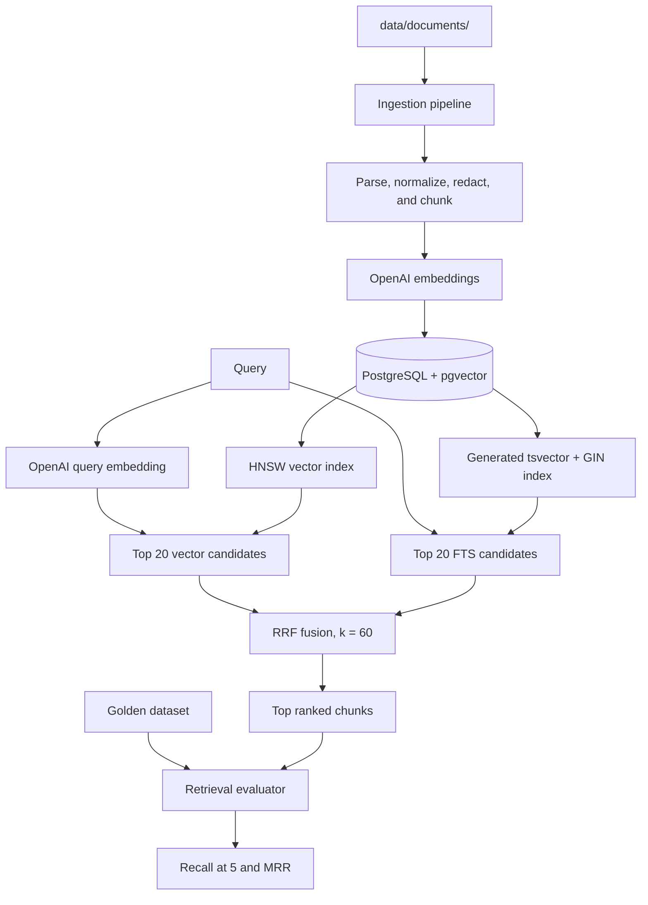

# System Flow

## Purpose and scope

This repository is a retrieval-only pipeline. It ingests documents, creates
vector and full-text indexes, retrieves relevant chunks with hybrid search, and
evaluates retrieval accuracy. It deliberately does not generate answers, call
chat-completion models, or orchestrate agents.

## Components



## Configuration

Configuration loads `.env` first and fills any missing values from `.env.local`.
The required runtime values are:

- `OPENAI_API_KEY`: used only for `text-embedding-3-small` embedding requests.
- `DATABASE_URL`: points to PostgreSQL with the pgvector extension available.

The default embedding model is `text-embedding-3-small` with 1,536 dimensions.
The provided Docker Compose service runs `pgvector/pgvector:pg16` locally.

## Ingestion

Run ingestion with:

```bash
.venv/bin/benchmark-ingest --source-dir data/documents --create-indexes
```

The pipeline discovers `.txt`, `.json`, and `.md` files, identifies policy,
Discord, and transcript sources from their names/locations, then:

1. Parses source-specific structures into normalized source units.
2. Redacts common credential patterns before text leaves the machine.
3. Chunks text at source boundaries using token-aware limits and overlap.
4. Builds an embedding input with source provenance metadata.
5. Requests embeddings from OpenAI in batches.
6. Persists each chunk, embedding, metadata, and content hash to PostgreSQL.

`document_chunks` has a generated `search_vector` column. PostgreSQL derives it
from `chunk_text` using the English text-search configuration, so FTS data stays
in sync with each inserted or updated chunk.

### Re-ingestion behavior

Normal ingestion compares SHA-256 hashes of chunk text against existing rows.
Known chunks are skipped, so unchanged text is not embedded again. This is an
incremental content-deduplication strategy, not full source synchronization:
chunks removed from a source can remain in the database.

Use `--force` when a source has been edited or deleted and the database should
contain only its current chunks. For each supplied source file, this deletes its
existing chunks and re-embeds the current content.

## Storage and indexes

The PostgreSQL schema stores:

- `chunk_text`, source filename, chunk index, token count, and JSON metadata.
- `embedding vector(1536)` for semantic nearest-neighbor search.
- `search_vector tsvector` for keyword/full-text search.
- A SHA-256 content hash for incremental ingestion.

`--create-indexes` creates an HNSW cosine-similarity index for pgvector, a GIN
index for `search_vector`, and a source/chunk index for maintenance operations.

## Hybrid retrieval

`hybrid_search(query, top_k=5)` is the primary retrieval API.

1. The query is embedded once with the configured embedding model.
2. Vector search and PostgreSQL FTS each retrieve their top 20 candidates
   concurrently using separate database connections.
3. Candidates are deduplicated by chunk ID and re-ranked with Reciprocal Rank
   Fusion:

   ```text
   score(chunk) = sum(1 / (60 + rank_in_retrieval_mode))
   ```

   Ranks are one-based. A chunk returned by both vector and FTS search receives
   a contribution from both ranks.
4. The highest fused results are returned with chunk content, provenance, and
   the RRF score.

For manual inspection:

```bash
.venv/bin/benchmark-search --query "equipment reimbursement"
.venv/bin/benchmark-search --mode fts --query "equipment reimbursement"
.venv/bin/benchmark-search --mode vector --query "remote work policy"
```

The hybrid command emits JSON. `hybrid` results contain `rrf_score`; `fts` and
`vector` modes show their respective native ranking scores.

### Search response format

`benchmark-search` returns one JSON object:

```json
{
  "mode": "hybrid",
  "query": "home office equipment reimbursement",
  "results": []
}
```

- `mode` is `hybrid`, `fts`, or `vector`.
- `query` is the submitted search text.
- `results` contains up to the requested number of ranked chunks; the default
  is five.

Every result has this structure:

```json
{
  "rank": 1,
  "chunk_id": 10,
  "source_file": "sample_policy.txt",
  "chunk_index": 8,
  "rrf_score": 0.03278688524590164,
  "text": "Retrieved chunk text.",
  "metadata": {}
}
```

- `rank` is the final result position.
- `chunk_id` is the stable PostgreSQL chunk ID used by the golden dataset's
  `expected_chunk_ids` field.
- `source_file` and `chunk_index` identify the source location.
- `text` is the complete retrieved chunk.
- `metadata` contains provenance such as section, source type, source date,
  channel, speakers, or meeting data when available.
- `rrf_score` is a rank-fusion score, not a probability or confidence value.

FTS-only results use `fts_score`; vector-only results use `vector_score`.
There is intentionally no `answer`, `confidence`, or generated summary.

## Retrieval evaluation

Evaluation uses a reviewed golden JSON dataset. Every record has:

```json
{
  "question_id": "lookup-01",
  "question": "What is the reimbursement limit?",
  "expected_chunk_ids": [101],
  "query_category": "lookup"
}
```

Supported categories are:

- `lookup`: exactly one target chunk.
- `multi_chunk`: two or more target chunks.
- `unanswerable`: no target chunks.

The included template has 30 records: 10 of each category. Its chunk IDs are
placeholders and must be replaced with reviewed IDs from the ingested corpus.

Run it with:

```bash
.venv/bin/benchmark-evaluate --dataset /path/to/golden_queries.json
```

For lookup and multi-chunk queries, the evaluator reports:

- **Recall@5**: the fraction of expected chunk IDs found among the first five
  hybrid results.
- **MRR**: reciprocal rank of the first expected chunk among the first five,
  or zero when no target is returned.

Unanswerable records remain in per-query output but are excluded from aggregate
Recall@5 and MRR because they have no relevant chunk IDs.

## Verification levels

- `pytest`: deterministic unit tests for chunking, embeddings, RRF, and metrics.
- `pytest -m integration_live tests/integration/test_hybrid_pgvector.py`: uses
  the local Docker pgvector service and real OpenAI embeddings. It ingests two
  small fixtures, verifies FTS/vector/hybrid retrieval, and clears its test rows.

## Current limitations

- There is no answer-generation or relevance/abstention layer.
- Golden chunk IDs require manual review after corpus ingestion.
- Incremental ingestion does not yet delete stale chunks without `--force`.
- FTS uses PostgreSQL's English configuration; multilingual corpora need a
  language-aware search configuration.
